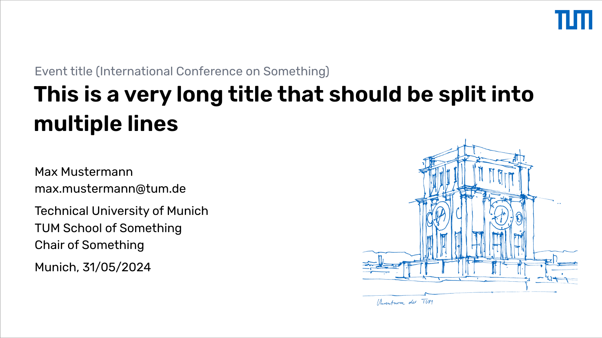
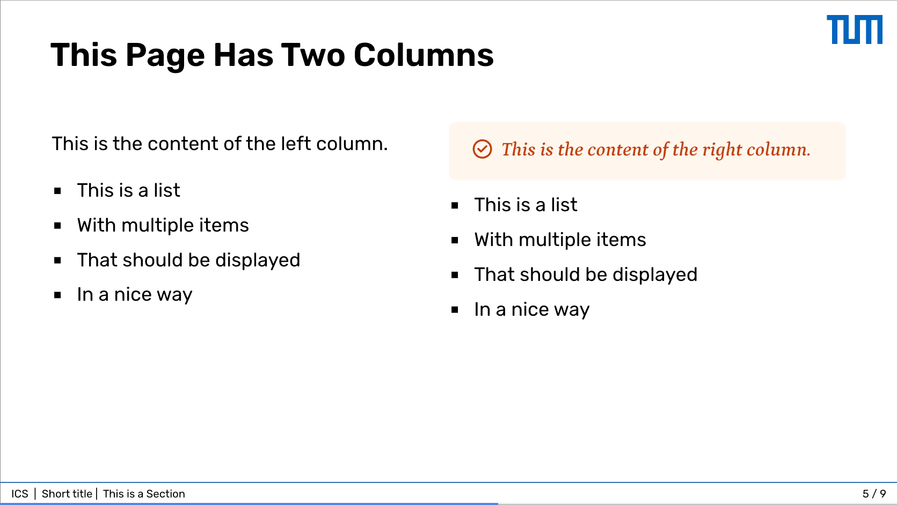

# slidev-theme-tum-unofficial

An unofficial TUM presentation theme for [Slidev](https://sli.dev).




## Install

To install the theme, run the following command in your Slidev project:

```bash
pnpm add git+https://github.com/c-lyu/slidev-theme-tum-unofficial.git
```

## Usage

Add the following frontmatter to your `slides.md`. Start Slidev then it will prompt you to install the theme automatically.

```md
---
theme: tum-unofficial

# Event and presentation details
event: Event title (International Conference on Something)
short_event: Short event title
title: This is a very long title that should be split into multiple lines
short_title: Short title
footer: true
date: 31/05/2024

# Author information
author: Max Mustermann
email: max.mustermann@tum.de
institute: Technical University of Munich
department: TUM School of Something
chair: Chair of Something
location: Munich

# Enable markdown components
mdc: true
---
```

Learn more about [how to use a theme](https://sli.dev/themes/use).

## Getting Started

To start the slide show:

- `pnpm install`
- `pnpm run dev`
- visit http://localhost:3030

To build the slide show:

- `pnpm run build`
- The output will be in the `dist` folder

To export the slide show as PDF:

- `pnpm run export`

## Layouts

The theme provides the following layouts:

- **default**: Default slide layout
- **cover**: Cover page with title and author information
- **section**: Section divider with large text
- **ending**: Ending slide with author information
- **two-cols-header**: Two-column layout with header
- **quote**: Quote layout for displaying quotations
- **fact**: Layout for highlighting facts
- **intro**: Introduction layout
- **statement**: Statement layout for key points

## Components

The theme provides the following components:

**Internal Components**:
- **AuthorInfo**: Author information on the cover and ending page
- **Footer**: Footer with title and page number
- **TumLogo**: TUM logo
- **TumSketch**: TUM sketch image

**Custom Components**:
- **Alert**: Alert box
  - `color`: Background and text color. (String: see [Colors](#colors) section)
  - `icon`: Main icon. (String: `question` | `warning` | `check`)
- **Card**: Card box
  - `title`: Card title. (String)
  - `color`: Background and title text color. (String: see [Colors](#colors) section)
- **Image**: Image box
  - `src`: Image source. (String)
  - `alt`: Image alternative text and caption text. (String)
  - `figureClass`: Image figure class. (String)
  - `imgClass`: Image class. (String)
  - `objectFit`: Image object-fit style. (String, default: 'contain')
  - `width`: Image width. (String | Number)
  - `height`: Image height. (String | Number)
  - `caption`: Image caption text. (String)
  - `lazy`: Enable lazy loading. (Boolean, default: true)
  - `fallbackSrc`: Fallback image source if original fails to load. (String)
- **Marker**: Marker box for highlighting text
  - `color`: Marker color. (String: see [Colors](#colors) section)
- **Gallery**: Gallery component for displaying multiple items in a row
  - Automatically arranges child components in a flexible row layout
- **Row**: Flexible row layout component
  - `gap`: Gap between items. (Number: `1` | `2` | `4` | `10` | `20`, default: `20`)
  - `classes`: Additional CSS classes. (String)
  - `justify`: Horizontal alignment. (String: `start` | `end` | `center` | `between` | `around` | `evenly`, default: `center`)
  - `items`: Vertical alignment. (String: `start` | `end` | `center` | `baseline` | `stretch`, default: `end`)

## Colors

The theme supports the following colors for components:

- `tumblue` (primary TUM blue)
- `red`, `green`, `blue`, `sky`, `yellow`, `purple`, `pink`, `orange`
- `gray`, `indigo`, `violet`, `rose`, `emerald`, `teal`, `cyan`
- `amber`, `lime`, `fuchsia`, `slate`, `zinc`, `stone`

## Enhanced Markdown Features

The theme supports enhanced markdown syntax:

- **Highlighted text**: `==highlighted text==` renders as ==highlighted text==  
- **Underlined text**: `++underlined text++` renders as ++underlined text++
- **Strikethrough**: `~~strikethrough~~` renders as ~~strikethrough~~

## Example Usage

```md
---
layout: section
section: Results
---

---

# Some Useful Information

::card{title="This is a card"}
This is the content of the card.

- This is a list
- With multiple items
- That should be displayed
- In a nice way
::

---

# Layout Examples

<Row gap="4" justify="between">
  <Image src="image1.jpg" alt="First image" />
  <Image src="image2.jpg" alt="Second image" />
</Row>

<Gallery>
  <Card title="Card 1" color="tumblue">Content 1</Card>
  <Card title="Card 2" color="green">Content 2</Card>
  <Card title="Card 3" color="purple">Content 3</Card>
</Gallery>

---

# Text Highlighting

This is an important ==highlighted== piece of information.
This is ++underlined information++.
This is ~~crossed out~~ information.

<Marker color='orange'>This text is marked in orange</Marker>

::alert{icon='check' color='green'}
This is a success alert with a check icon.
::
```

## License

This theme is licensed under the [MIT License](./LICENSE).
